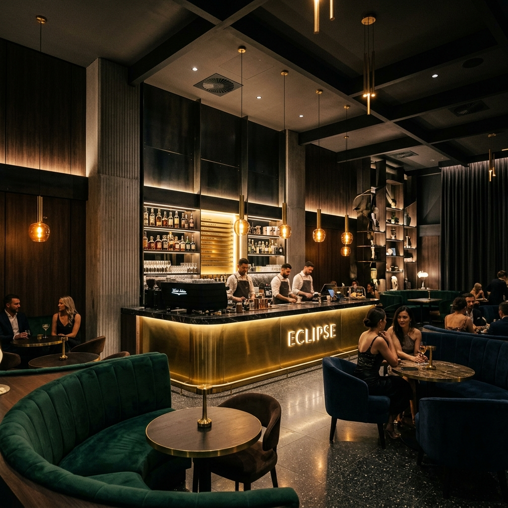

# ☕ SEISTE CAFE - AI Concierge Gastronomy

<div align="center">
  
  <p><em>"Nitelikli Kahve ve Artizan Çikolatanın Yapay Zeka ile Buluştuğu Nokta"</em></p>
</div>

---

## 🌟 Proje Hakkında

**Seiste Cafe**, Nişantaşı'nın kalbinde yer alan, butik kahve deneyimini ve zanaatkar çikolata sanatını dijital bir şahesere dönüştüren modern bir web platformudur. Sadece bir bilgilendirme sitesi değil, aynı zamanda misafirlere özel bir **AI Concierge (Yapay Zeka Danışmanı)** hizmeti sunan interaktif bir deneyim alanıdır.

## ✨ Temel Özellikler

- **🤖 Akıllı AI Danışmanı:** OpenAI destekli (simüle edilmiş/entegre edilebilir) akıllı sohbet arayüzü ile menü detayları, kahve kökenleri ve çikolata içerikleri hakkında anlık bilgi.
- **📅 Akıllı Rezervasyon:** AI üzerinden sesli veya metin tabanlı (simüle) kolay masa rezervasyon akışı.
- **🎞️ Premium UI/UX:** Framer Motion ile güçlendirilmiş, akışkan geçişler ve lüks bir görsellik sunan modern arayüz.
- **☕ Gastronomi Kütüphanesi:** Ethiopia Yirgacheffe'den Panama Geisha'ya, el yapımı Belçika trüflerinden özel patisserie ürünlerine kadar detaylı ürün kürasyonu.
- **📱 Tam Duyarlı Tasarım:** Masaüstü, tablet ve mobil cihazlar için optimize edilmiş kusursuz görünüm.

## 🛠️ Teknoloji Yığını

- **Framework:** [React 19](https://react.dev/)
- **Build Tool:** [Vite 6](https://vitejs.dev/)
- **Styling:** [Tailwind CSS 4.0](https://tailwindcss.com/)
- **Animations:** [Framer Motion 12](https://www.framer.com/motion/)
- **Icons:** [Lucide React](https://lucide.dev/)
- **Language:** [TypeScript](https://www.typescriptlang.org/)

## 🚀 Başlangıç

Projeyi yerel makinenizde çalıştırmak için aşağıdaki adımları izleyebilirsiniz:

1. **Depoyu kopyalayın:**
   ```bash
   git clone https://github.com/sandrotonal/ai-cafe.git
   cd ai-cafe
   ```

2. **Bağımlılıkları yükleyin:**
   ```bash
   npm install
   ```

3. **Geliştirme sunucusunu başlatın:**
   ```bash
   npm run dev
   ```

## 📍 Konum
**Nişantaşı, İstanbul**  
Valikonağı Caddesi No: 42, Şişli

---

<div align="center">
  Proudly developed by <strong>Sandro Tonal</strong>
</div>

import reactDom from 'eslint-plugin-react-dom'

export default defineConfig([
  globalIgnores(['dist']),
  {
    files: ['**/*.{ts,tsx}'],
    extends: [
      // Other configs...
      // Enable lint rules for React
      reactX.configs['recommended-typescript'],
      // Enable lint rules for React DOM
      reactDom.configs.recommended,
    ],
    languageOptions: {
      parserOptions: {
        project: ['./tsconfig.node.json', './tsconfig.app.json'],
        tsconfigRootDir: import.meta.dirname,
      },
      // other options...
    },
  },
])
```
